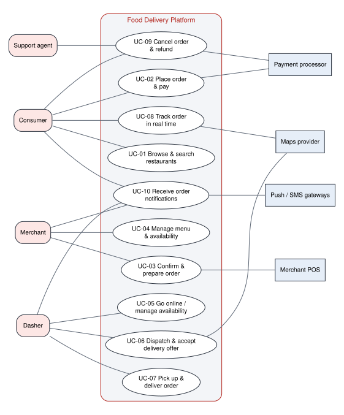
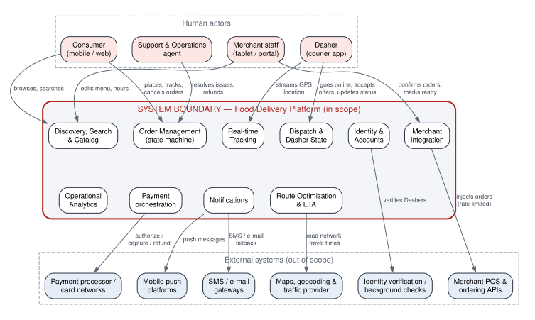
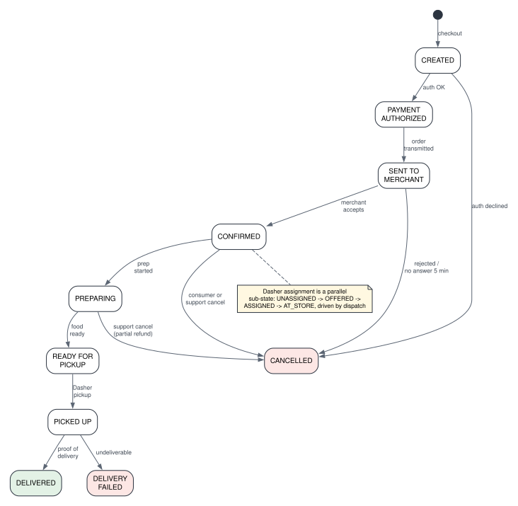
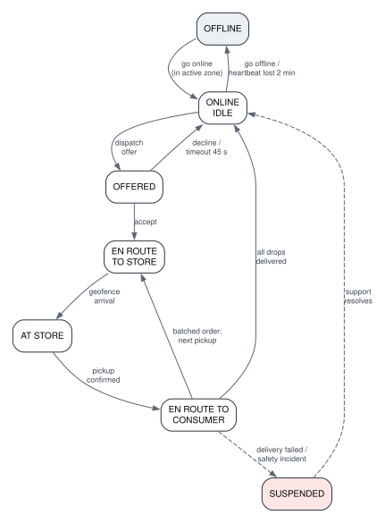

<section class="cover">

Universidad Distrital Francisco José de Caldas School of Engineering · Computer Engineering Program

Cloud Computing · Semester 2026-III

DoorDash — Food Delivery Platform

Delivery No. 1 — Requirements &amp; Workload Model

Focus domain: Order Management, Route Optimization &amp; Notifications

<table>
<tr><td><b>Team</b></td><td>Team 2</td></tr>
<tr><td><b>Members</b></td><td>Daniel Felipe Barrera Suárez Jaider Camilo Carvajal Marín Nelson David Posso Suárez Edward Julián García Gaitán Julián David Cabrera Barragán</td></tr>
<tr><td><b>Professor</b></td><td>Eng. Carlos Andrés Sierra, M.Sc.</td></tr>
<tr><td><b>Date</b></td><td>September 2026</td></tr>
</table>

</section>

<!-- TOC -->

## 1. Executive Summary

DoorDash is a three-sided, last-mile logistics marketplace that connects **consumers** who want food and convenience goods, **merchants** (restaurants and stores) who prepare them, and independent couriers called **Dashers** who carry them. In fiscal year 2025 the company processed roughly **3.17 billion orders** (≈ 8.7 million per day), served **more than 56 million monthly active users**, partnered with **more than 1 million merchants** and operated in **more than 40 countries** [1][2]. Order volume grew about **23 % year over year** between 2024 and 2025 [1][3].

This document specifies the system that Team 2 will design during the semester: a food delivery platform focused on **order management, route optimization and notifications**. The course assignment fixes the design-point workload at **50,000+ concurrent orders during peak hours, 1,000+ restaurants and complex routing**, with **99.9 % availability**, **eventual consistency for order status** and **time-based SLAs (delivery windows)** [4]. We size the system at that design point and scale every other quantity (users, requests, data) from DoorDash's public figures, so that each value in the workload model is traceable to a source.

The problem is a hard distributed-systems problem for five reasons:

1. **Every order is a long-running, multi-party workflow.** A single order lives ~40 minutes and passes through about ten states that are driven by four different parties (consumer, payment processor, merchant, Dasher). The state must survive partial failures and reach all parties quickly, which makes the order a distributed state machine rather than a database row.
2. **Demand is extremely peaked.** Dinner (≈ 16:30–20:00 local time) concentrates demand; the peak hour carries about **2.9×** the average hourly load, and the system must absorb it without violating delivery windows.
3. **Dispatch and routing are real-time optimization problems.** Each order must be matched to one of tens of thousands of moving Dashers, possibly batched with other orders, while predicting food-preparation and travel times [5][6].
4. **Telemetry dominates the write path.** Online Dashers report GPS positions every few seconds [7]; at peak this is ~36 million writes per hour — more than twice all other traffic combined.
5. **The platform depends on systems it does not control.** Merchant point-of-sale (POS) systems impose API rate limits [8], payment processors and maps providers add latency and failure modes, and the platform spans several countries and time zones (multi-region orchestration).

The headline design-point numbers are summarized below and justified in Section 5.

| Metric | Average | Peak (dinner) |
|---|---|---|
| Concurrent orders in flight | 17,400 | **50,000** |
| New orders per hour | 26,000 | 75,000 |
| Total requests per hour | 21.7 M (≈ 6,000 req/s) | 51.6 M (≈ 14,300 req/s) |
| Online Dashers | 22,600 | 50,000 |
| Availability target | 99.9 % (≤ 43.8 min downtime / month) | |

## 2. System Description

### 2.1 Business Problem

**Pain point.** Restaurants traditionally could only serve customers who walked in or who lived within reach of their own (expensive, under-utilized) delivery staff. Consumers could only order from the few restaurants that delivered. Individual couriers had no steady flow of work. DoorDash solves this coordination problem by pooling demand from millions of consumers and supply from millions of flexible couriers, so that almost any local merchant can offer on-demand delivery within a promised time window.

**Who benefits.**

- *Consumers* get selection (thousands of merchants in a city) and convenience (delivery in well under an hour, with live tracking).
- *Merchants* get incremental sales without running a fleet — DoorDash generated nearly **$75 billion in sales for local merchants** in 2025 [1].
- *Dashers* get flexible earning opportunities — more than **8 million people dashed in 2024**, earning over **$18 billion** [2]; Dasher earnings exceeded **$20 billion** in 2025 [1].

**Why it is operationally challenging at scale.**

- *Time is the product.* Value is lost if food arrives cold or late. The platform must quote a delivery window before checkout and then keep it, which couples order management, dispatch and routing into one real-time control loop.
- *Three-sided coordination.* Each order requires a consumer, a merchant and a Dasher to act in the right order. Any of them can be slow, offline or cancel.
- *Peaks and geography.* Demand surges at lunch and dinner in each time zone, and weather or sporting events create local spikes.
- *External dependencies.* Merchant integrations are heterogeneous (tablet, POS API, e-mail/phone) and rate-limited; payment authorization and maps queries are remote calls to third parties.
- *Consistency trade-offs.* Payment records must be exact, but order-status views can be eventually consistent as long as they converge within seconds.

### 2.2 Actors

| ID | Actor | Type | Role | Interaction frequency | Expectations |
|---|---|---|---|---|---|
| A-01 | Consumer | Human | Browses merchants, places, pays for, tracks and rates orders. | ~4 sessions per order, ~25 requests per session; continuous tracking while an order is active. | Fast browsing (< 300 ms), accurate ETA, live location, reliable payment, clear notifications. |
| A-02 | Merchant staff | Human | Receives, confirms and prepares orders; maintains menu, prices, hours and item availability. | ~10 interactions per order; menu edits several times per day. | Orders arrive immediately and exactly once; simple confirm / ready actions; Dasher arrives when food is ready. |
| A-03 | Dasher | Human | Goes online, accepts or declines delivery offers, picks up and drops off orders. | Location report every ~5 s while online; ~15 actions per delivery. | Fair, well-paid offers; accurate navigation and pickup times; instant earnings visibility. |
| A-04 | Support & Operations agent | Human | Resolves order problems, issues refunds and credits, monitors markets. | Low volume (≈ 2–5 % of orders need support). | Complete order timeline; authority to cancel, refund, reassign. |
| A-05 | Payment processor | External system | Authorizes, captures and refunds card payments; tokenizes cards. | 3–4 calls per order. | Idempotent requests; compliant handling of card data. |
| A-06 | Merchant POS / ordering API | External system | Receives orders directly in the merchant's point-of-sale system; returns confirmations. | ~2–4 calls per order; subject to per-merchant rate limits (e.g. ~300 requests per 60 s) [8]. | Requests within declared rate limits; retries without duplicates. |
| A-07 | Maps & traffic provider | External system | Geocoding, road network, travel-time and traffic estimates. | Many calls per dispatch cycle; cached aggressively. | Bounded query volume; tolerant of stale traffic data. |
| A-08 | Push / SMS / e-mail gateways | External system | Deliver notifications to devices and phone numbers. | ~8 messages per order. | Well-formed, de-duplicated, rate-respecting messages. |
| A-09 | Identity verification provider | External system | Verifies identity and background checks for new Dashers. | Once per Dasher onboarding. | Secure transfer of personal data; asynchronous results. |

### 2.3 Main Use Cases

Each use case below lists its actors, preconditions, main flow, alternative flows and postconditions. The functional requirements that realize each use case are given in brackets and in the traceability matrix (Section 3.2).

#### UC-01 Browse and search restaurants [FR-02, FR-03]

- **Actors:** Consumer; Maps provider (secondary).
- **Preconditions:** Consumer has a delivery address (typed or from device location).
- **Main flow:** (1) Consumer opens the app. (2) System resolves the address to a delivery zone. (3) System lists merchants that are open and deliver to the zone, ranked, each with an estimated delivery window and fee. (4) Consumer searches by keyword or cuisine, or filters. (5) Consumer opens a merchant and sees the current menu with only available items.
- **Alternative flows:** 3a. No merchant serves the address — system shows "no delivery available" and suggests pickup. 5a. Merchant closes while being viewed — checkout is disabled with an explanation.
- **Postconditions:** No state change; browsing events are recorded for analytics.

#### UC-02 Place order and pay [FR-01, FR-04, FR-05, FR-07, FR-10]

- **Actors:** Consumer; Payment processor.
- **Preconditions:** Consumer is authenticated; cart contains items from one open merchant; valid payment method on file.
- **Main flow:** (1) Consumer reviews cart; system re-prices items, fees, taxes and promotions and quotes a delivery window. (2) Consumer confirms. (3) System creates the order with an idempotency key. (4) System requests payment authorization for the total. (5) On approval the order moves to PAYMENT_AUTHORIZED and is handed to merchant integration (UC-03) and dispatch (UC-06). (6) Consumer sees confirmation and the quoted window.
- **Alternative flows:** 4a. Authorization declined — order is CANCELLED, consumer asked for another method. 3a. Consumer taps "confirm" twice or the network retries — the idempotency key returns the same order, no duplicate charge. 1a. Item or price changed since it was added — consumer must re-confirm.
- **Postconditions:** Exactly one order exists with an authorized (not yet captured) payment and a quoted delivery window.

#### UC-03 Confirm and prepare order [FR-05, FR-06]

- **Actors:** Merchant staff; Merchant POS (secondary).
- **Preconditions:** Order is PAYMENT_AUTHORIZED; merchant is open.
- **Main flow:** (1) System transmits the order to the merchant through its integration channel (POS API, tablet, or fallback). (2) Merchant confirms and optionally adjusts preparation time. (3) Order moves to CONFIRMED then PREPARING. (4) Merchant marks the order READY FOR PICKUP (or the system infers it from the prep-time estimate).
- **Alternative flows:** 1a. POS rate limit reached — transmission is queued and retried within the limit. 2a. Merchant rejects (item out of stock) — order CANCELLED, authorization voided, consumer notified. 2b. No response within 5 minutes — escalation call, then automatic cancellation.
- **Postconditions:** Merchant has accepted the order exactly once and the expected ready time is known to dispatch.

#### UC-04 Manage menu and availability [FR-03]

- **Actors:** Merchant staff; Merchant POS.
- **Preconditions:** Merchant account is active.
- **Main flow:** (1) Merchant edits items, prices, photos, opening hours or marks an item out of stock (or the POS pushes the change). (2) System validates and versions the menu. (3) Consumers see the change within 60 seconds.
- **Alternative flows:** 2a. Invalid price or missing mandatory data — change rejected with reason. 1a. Merchant "pauses" the store during a rush — merchant hidden from discovery until resumed.
- **Postconditions:** A new menu version is active; carts containing removed items are flagged at checkout.

#### UC-05 Go online and manage availability (Dasher) [FR-01, FR-08, FR-11]

- **Actors:** Dasher.
- **Preconditions:** Dasher account is verified and active.
- **Main flow:** (1) Dasher selects a zone and goes online. (2) System marks the Dasher ONLINE IDLE and starts accepting location reports. (3) Dasher receives offers (UC-06) until going offline.
- **Alternative flows:** 2a. Zone is saturated — Dasher is placed on a waitlist. 3a. Location heartbeat lost for 2 minutes — Dasher set OFFLINE, excluded from dispatch.
- **Postconditions:** Dasher state and last known location are available to dispatch.

#### UC-06 Dispatch and accept delivery offer [FR-08, FR-09, FR-10]

- **Actors:** Dasher; Maps provider.
- **Preconditions:** Order is CONFIRMED; at least one ONLINE Dasher in range.
- **Main flow:** (1) Dispatch periodically evaluates unassigned orders and nearby Dashers, predicting pickup and drop-off times. (2) It chooses the assignment (possibly batching two orders from nearby merchants) that best meets delivery windows and Dasher efficiency [5][6][14]. (3) The Dasher receives an offer showing pay, distance and pickup location. (4) Dasher accepts within 45 s. (5) Order's Dasher sub-state becomes ASSIGNED and the ETA is recalculated.
- **Alternative flows:** 4a. Dasher declines or times out — the order re-enters the next dispatch cycle. 2a. No Dasher available — the delivery window is re-quoted and the consumer notified; incentives may be raised.
- **Postconditions:** Exactly one Dasher is responsible for the order; consumer and merchant see the Dasher and ETA.

#### UC-07 Pick up and deliver order [FR-05, FR-08, FR-10, FR-12]

- **Actors:** Dasher; Merchant staff; Consumer.
- **Preconditions:** Order ASSIGNED to the Dasher.
- **Main flow:** (1) Dasher navigates to the store (EN ROUTE TO STORE). (2) Arrival detected by geofence (AT STORE). (3) Dasher confirms pickup (PICKED UP). (4) Dasher navigates to the consumer; for batched orders, the route is re-sequenced. (5) Dasher confirms drop-off with photo or PIN (DELIVERED). (6) System captures payment and records Dasher earnings.
- **Alternative flows:** 2a. Food not ready — wait time recorded, ETA updated. 5a. Consumer unreachable — follow the contact protocol; after the timeout the order is DELIVERY FAILED and support decides refund policy.
- **Postconditions:** Order DELIVERED; payment captured; earnings recorded; Dasher returns to IDLE.

#### UC-08 Track order in real time [FR-10, FR-11, FR-12]

- **Actors:** Consumer.
- **Preconditions:** Consumer has an active order.
- **Main flow:** (1) Consumer opens the order screen. (2) System shows the current state, the ETA and — once the Dasher is assigned — the Dasher's position on a map refreshed at least every 5 s. (3) System pushes state changes as they occur.
- **Alternative flows:** 2a. Dasher location stale (> 30 s) — map shows last known position with a "location updating" hint. 3a. Push connection lost — client falls back to periodic refresh.
- **Postconditions:** No state change.

#### UC-09 Cancel order and refund [FR-05, FR-07, FR-12]

- **Actors:** Consumer or Support agent; Payment processor.
- **Preconditions:** Order not yet DELIVERED.
- **Main flow:** (1) Actor requests cancellation. (2) System evaluates the cancellation policy for the current state (full refund before merchant confirmation; partial after preparation starts). (3) Order moves to CANCELLED. (4) Merchant and Dasher are notified; the Dasher is released. (5) Authorization is voided or a refund issued.
- **Alternative flows:** 2a. Order already PICKED UP — consumer self-cancel not allowed; routed to support.
- **Postconditions:** Order CANCELLED; financial records balanced; all parties informed.

#### UC-10 Receive order notifications [FR-12]

- **Actors:** Consumer, Merchant, Dasher; Push/SMS gateways.
- **Preconditions:** Actor has a registered device or phone and notification preferences.
- **Main flow:** (1) An order or delivery state changes. (2) System selects recipients, channel and localized template. (3) Message is delivered through the push gateway. (4) Delivery receipt is recorded.
- **Alternative flows:** 3a. Push not delivered within 30 s for a critical message (e.g. "Dasher arriving") — SMS fallback. 2a. Duplicate event — suppressed by de-duplication.
- **Postconditions:** Each recipient receives each notification at most once per event.

### 2.4 System Boundaries

The diagram below shows the platform as the system under design and the actors and external systems around it. The capability boxes inside the boundary are *functional areas*, not a service decomposition — that decomposition is the subject of Delivery 2.

| Inside the scope (we design and build) | Outside the scope (we integrate with or ignore) |
|---|---|
| Consumer, merchant and Dasher accounts, authentication and roles | Card processing, card networks, bank settlement (payment processor) |
| Merchant catalog: stores, menus, hours, availability | The merchant's own POS, kitchen display and inventory systems |
| Discovery and search of merchants and items | Map data, geocoding and traffic data (maps provider) |
| Cart, checkout, pricing of fees and order state machine | Delivery of push messages / SMS / e-mail to devices (gateways) |
| Payment orchestration (authorize / capture / refund) and Dasher earnings ledger | Identity verification and background checks for Dashers |
| Merchant order transmission with rate limiting and retries | Dasher payouts to bank accounts, tax filing, accounting |
| Dispatch (order–Dasher assignment and batching) | Marketing campaigns, advertising platform, loyalty membership billing |
| Route optimization and ETA prediction | Grocery / retail inventory, pharmacy, alcohol age-verification flows |
| Real-time Dasher location tracking | Customer-support tooling beyond order actions (ticketing, telephony) |
| Notifications orchestration (who, what, when, which channel) | Machine-learning model training platform (models are consumed, not trained) |
| Operational event stream for analytics dashboards | Corporate data warehouse and BI reporting |

## 3. Functional Requirements

### 3.1 Requirement Catalog

Requirements follow the pattern *"The system shall [action] [object] [condition/constraint]"* and are grouped by functional domain. Identifiers are stable and will be used for traceability in Deliveries 2–4.

#### Domain: Identity & Accounts

| ID | Requirement | Use cases | Verification |
|---|---|---|---|
| **FR-01** | The system shall register and authenticate consumers, merchant staff, Dashers and support agents, and shall authorize every operation according to the actor's role, so that a Dasher can only act on orders assigned to them and merchant staff only on their own store's orders. | UC-02, UC-05 | Access-control tests per role; attempts outside the role are rejected with an authorization error. |

#### Domain: Catalog & Discovery

| ID | Requirement | Use cases | Verification |
|---|---|---|---|
| **FR-02** | The system shall return, for a given delivery address, the list of open merchants that deliver to that address, ranked and each annotated with an estimated delivery window and delivery fee, and shall support keyword and cuisine search over merchant and item names. | UC-01 | Search results contain only open, in-range merchants; each result has a window and fee. |
| **FR-03** | The system shall allow merchants (directly or through their POS) to create, update, version and pause menus, prices, item availability and opening hours, and shall make every change visible to consumers within 60 seconds. | UC-01, UC-04 | Timestamp difference between merchant edit and consumer visibility ≤ 60 s at p99. |

#### Domain: Order Management

| ID | Requirement | Use cases | Verification |
|---|---|---|---|
| **FR-04** | The system shall accept an order only after re-validating items, prices, fees, taxes and merchant status at checkout, shall assign it a unique identifier and a quoted delivery window, and shall treat repeated submissions with the same idempotency key as the same order. | UC-02 | Duplicate submission test yields one order and one authorization. |
| **FR-05** | The system shall manage every order through the state machine CREATED → PAYMENT AUTHORIZED → SENT TO MERCHANT → CONFIRMED → PREPARING → READY FOR PICKUP → PICKED UP → DELIVERED (with terminal states CANCELLED and DELIVERY FAILED), shall reject invalid transitions, shall record each transition with timestamp and actor in an immutable order history, and shall apply the state-dependent cancellation policy. | UC-02, UC-03, UC-07, UC-09 | Invalid-transition tests; history completeness audit for sampled orders. |

#### Domain: Merchant Integration

| ID | Requirement | Use cases | Verification |
|---|---|---|---|
| **FR-06** | The system shall transmit each paid order to its merchant through the merchant's configured channel (POS API, tablet or fallback), shall never exceed the merchant's declared API rate limit, shall retry failed transmissions without creating duplicates, and shall cancel and notify if the merchant neither confirms nor rejects within 5 minutes. | UC-03 | Load test against a rate-limited merchant simulator: zero limit violations, zero duplicate orders. |

#### Domain: Payments

| ID | Requirement | Use cases | Verification |
|---|---|---|---|
| **FR-07** | The system shall authorize the order total at checkout, capture the final amount after delivery, void or refund according to the cancellation policy, record Dasher earnings for each completed delivery, and guarantee that every monetary operation is executed at most once per order event. | UC-02, UC-07, UC-09 | Reconciliation: sum of captures and refunds per order equals the order's final balance. |

#### Domain: Dispatch & Route Optimization

| ID | Requirement | Use cases | Verification |
|---|---|---|---|
| **FR-08** | The system shall maintain the state of every Dasher (OFFLINE, ONLINE IDLE, OFFERED, EN ROUTE TO STORE, AT STORE, EN ROUTE TO CONSUMER, SUSPENDED) and set a Dasher OFFLINE after 2 minutes without a location heartbeat. | UC-05, UC-06, UC-07 | State-transition tests; heartbeat-loss test. |
| **FR-09** | The system shall assign each confirmed order to an available Dasher, optionally batching up to two orders with compatible pickup locations and delivery windows, choosing assignments that minimize predicted lateness and Dasher idle time; offers not accepted within 45 seconds shall be re-dispatched. | UC-06 | Simulation: ≥ 95 % of orders assigned before their food-ready time at design-point load. |
| **FR-10** | The system shall compute the delivery window shown at checkout and recompute the ETA and the Dasher's route (pickup and drop-off sequence) whenever the order state, food-ready estimate or Dasher position changes materially. | UC-02, UC-06, UC-07, UC-08 | ETA error measured against actual delivery time (see NFR-14). |

#### Domain: Tracking & Notifications

| ID | Requirement | Use cases | Verification |
|---|---|---|---|
| **FR-11** | The system shall ingest Dasher location reports every 5 seconds while online and shall display the assigned Dasher's position and the current ETA to the consumer, refreshed at least every 5 seconds, from assignment until delivery. | UC-05, UC-08 | End-to-end latency from Dasher report to consumer map ≤ 5 s at p95. |
| **FR-12** | The system shall notify the consumer, the merchant and the Dasher of every order state change relevant to them through their preferred channel (push, falling back to SMS for critical messages), in their language, at most once per event. | UC-07, UC-08, UC-09, UC-10 | Event-to-notification latency ≤ 5 s at p95; duplicate-rate test. |

### 3.2 Traceability Matrix (Use Case ↔ Functional Requirement)

| | FR-01 | FR-02 | FR-03 | FR-04 | FR-05 | FR-06 | FR-07 | FR-08 | FR-09 | FR-10 | FR-11 | FR-12 |
|---|---|---|---|---|---|---|---|---|---|---|---|---|
| UC-01 Browse & search | | ● | ● | | | | | | | | | |
| UC-02 Place order & pay | ● | | | ● | ● | | ● | | | ● | | |
| UC-03 Confirm & prepare | | | | | ● | ● | | | | | | |
| UC-04 Manage menu | | | ● | | | | | | | | | |
| UC-05 Go online | ● | | | | | | | ● | | | ● | |
| UC-06 Dispatch & accept | | | | | | | | ● | ● | ● | | |
| UC-07 Pick up & deliver | | | | | ● | | ● | ● | | ● | | ● |
| UC-08 Track order | | | | | | | | | | ● | ● | ● |
| UC-09 Cancel & refund | | | | | ● | | ● | | | | | ● |
| UC-10 Notifications | | | | | | | | | | | | ● |

## 4. Non-Functional Requirements

All values refer to the **design point** defined in Section 5 (50,000 concurrent orders at peak). Derivations appear in the workload model.

### 4.1 Expected Users

| ID | Requirement |
|---|---|
| **NFR-01** | The system shall support **8 million registered consumers** (≈ 4 million monthly active), **700,000 registered Dashers** and **70,000 onboarded merchants** (≥ 1,000 required by the assignment). |
| **NFR-02** | The system shall support **≈ 84,000 concurrent active users on average** and **≈ 185,000 at peak** (≈ 90,000 consumers browsing or tracking, 50,000 online Dashers, 45,000 merchant devices). |

### 4.2 Throughput and Peak

| ID | Requirement |
|---|---|
| **NFR-03** | The system shall sustain **21.7 million requests per hour** on average (≈ 6,000 req/s), of which 5.4 M are transactional API requests and 16.3 M are Dasher location reports. |
| **NFR-04** | The system shall sustain **51.6 million requests per hour at peak** (≈ 14,300 req/s; 75,000 new orders per hour; 36 M location reports per hour) without violating the response-time targets of NFR-06 to NFR-09. |
| **NFR-05** | The system shall sustain peak load for a **3-hour dinner window** (16:30–20:00 local time, with ≥ 80 % of peak throughput for 2 hours) and a secondary lunch peak of ≈ 60 % of the dinner peak lasting 2 hours; short local bursts of **2× the peak arrival rate for 15 minutes** (weather, sports events) shall degrade gracefully rather than fail. |

### 4.3 Response Time (percentile-based, measured at the system edge)

| ID | Operation | p95 | p99 |
|---|---|---|---|
| **NFR-06** | Discovery, search and menu reads | < 300 ms | < 800 ms |
| **NFR-07** | Checkout (order creation including payment authorization) | < 1.5 s | < 3 s |
| **NFR-08** | Order status read / state-change acknowledgement to any actor | < 200 ms | < 500 ms |
| **NFR-09** | Dasher location → consumer map; order event → notification sent to gateway | < 5 s | < 10 s |
| **NFR-10** | Dispatch decision for an eligible order (first offer sent) | < 60 s | < 120 s |

### 4.4 Availability and Reliability

| ID | Requirement |
|---|---|
| **NFR-11** | The core ordering path (browse, checkout, order state, merchant transmission, dispatch, tracking) shall be available **99.9 % per calendar month**, i.e. at most **43.8 minutes of downtime per month** (8.8 hours per year) [11]. Non-critical functions (analytics, ranking personalization) shall be available 99.5 % (≤ 3.65 h/month) and their failure shall not affect ordering. |
| **NFR-12** | No confirmed order and no monetary operation shall be lost after acknowledgement to the actor (recovery point objective = 0 for orders and payments); the ordering path shall recover from the loss of a whole data center within 15 minutes. |

### 4.5 Consistency and Delivery SLA

| ID | Requirement |
|---|---|
| **NFR-13** | Order status may be **eventually consistent** across actors and views, but all views shall converge within **5 seconds** of a state change; payment records, order creation and Dasher assignment shall be **strongly consistent** (no double charge, no order assigned to two Dashers). |
| **NFR-14** | At least **95 % of orders shall be delivered within the delivery window quoted at checkout**, and the quoted ETA shall be within ±10 minutes of the actual delivery time for 90 % of orders. |
| **NFR-15** | The system shall respect each merchant's declared API rate limit 100 % of the time and shall absorb the resulting backlog without losing orders (FR-06). |

### 4.6 Data Volume and Growth

| ID | Requirement |
|---|---|
| **NFR-16** | The system shall store **≈ 8.5 TB at launch** (menus and images, user profiles, one year of migrated order history, 90 days of location history). |
| **NFR-17** | The system shall accommodate **≈ 54 TB of new data in the first year**, growing with order volume at **≈ 23 % per year** (≈ 66 TB in year 2, ≈ 82 TB in year 3). Order and payment records shall be retained 7 years; raw location traces 90 days online. |

### 4.7 Geographic Scope

| ID | Requirement |
|---|---|
| **NFR-18** | The system shall serve **North America (United States, Canada)** and **Latin America (Mexico, Colombia, Chile)** across time zones UTC−8 to UTC−3, with ≥ 80 % of traffic in North America. Round-trip network latency from any served metropolitan area to the serving location shall be < 80 ms, which implies serving from at least two geographically separate locations (west and east North America) plus one serving Latin America. |
| **NFR-19** | Personal data shall be stored and processed in compliance with local regulation of each country served (e.g. Colombia's Law 1581 of 2012 on personal data protection [12]), including the ability to keep a country's personal data within an agreed region. |

## 5. Workload Model

### 5.1 Methodology

The assignment fixes the design point at **50,000 concurrent orders at peak** [4]. We derive the rest of the profile in four steps:

1. **Orders in flight → order arrival rate (Little's Law).** For a stable system, *L = λ · W* [9]: the average number of orders in the system (*L*) equals the arrival rate (*λ*) times the time each order spends in the system (*W*). DoorDash deliveries typically take 30–60 minutes from order to door [10]; we use **W = 40 minutes** from checkout to delivery. So *λ_peak = 50,000 / 40 min = 1,250 orders/min = 75,000 orders/hour* (≈ 21 orders/s).
2. **Peak hour → daily volume.** Demand concentrates in the lunch and dinner windows; DoorDash's own guidance to Dashers places the dinner peak at 16:30–20:00 [13]. We assume the peak hour carries **12 %** of a day's orders (lunch + dinner ≈ 60 % of orders spread over ~5 hours). Daily volume = 75,000 / 0.12 ≈ **625,000 orders/day** (228 M/year) — about **7.2 %** of DoorDash's 2025 average of 8.7 M orders/day [1], i.e. a large multi-metro regional marketplace.
3. **Scale populations from public ratios.** DoorDash had 56 M MAU, > 1 M merchants and (2024) 8 M Dashers for 3.17 B (2.58 B) annual orders [1][2][3]. Applying the same per-order ratios to 228 M orders/year gives ≈ 4 M MAU (we assume 8 M registered = 2 × MAU), ≈ 72,000 merchants (→ 70,000) and ≈ 707,000 Dashers (→ 700,000).
4. **Requests per order.** We model each order's request footprint (browsing, checkout, tracking, merchant, notifications, payments) and add telemetry from online Dashers reporting every 5 s (DoorDash collects Dasher locations "every few seconds" [7]).

### 5.2 Request Footprint per Order

| Traffic class | Assumption | Peak / hour | Average / hour | Read / write |
|---|---|---|---|---|
| Browsing & search | 4 sessions per order × 25 requests | 7.50 M | 2.60 M | read |
| Order tracking | 120 status / map refreshes per active order-hour | 6.00 M | 2.08 M | read |
| Merchant interactions | 10 per order (transmit, confirm, ready, adjustments) | 0.75 M | 0.26 M | 50 / 50 |
| Notifications | 8 per order across 3 actors | 0.60 M | 0.21 M | write |
| Payments | 4 per order (authorize, capture, refund, ledger) | 0.30 M | 0.10 M | write |
| Auth, profile, ratings | 6 per order | 0.45 M | 0.16 M | 50 / 50 |
| **Transactional subtotal** | | **15.6 M** | **5.4 M** | **≈ 90 / 10** |
| Dasher location reports | every 5 s × online Dashers (50,000 peak / 22,600 avg) | 36.0 M | 16.3 M | write |
| **Total** | | **51.6 M (≈ 14,300 req/s)** | **21.7 M (≈ 6,000 req/s)** | **≈ 27 / 73** |

Average values use the average order rate (625,000 / 24 ≈ 26,000 orders/hour, i.e. 17,400 orders in flight by Little's Law) and 22,600 online Dashers (the peak Dasher-to-order ratio with 30 % more idle supply off-peak).

> **Observation.** The transactional API is read-heavy (≈ 90 % reads), but once Dasher telemetry is counted the platform is **write-dominated (≈ 73 % writes)**. These two workloads have opposite shapes and will be treated separately in the architecture.

### 5.3 Concurrent Users

| Population | Average | Peak | Derivation |
|---|---|---|---|
| Consumers browsing | 13,900 | 40,000 | sessions/hour × 8-min session ÷ 60 |
| Consumers tracking an order | 17,400 | 50,000 | = orders in flight |
| Dashers online | 22,600 | 50,000 | ≈ 1 online Dasher per order in flight at peak (batching offsets idle supply) |
| Merchant devices active | 30,000 | 45,000 | ≈ 65 % of 70,000 merchants open at dinner |
| **Total** | **≈ 84,000** | **≈ 185,000** | |

### 5.4 Data Volume

| Data class | Unit size | Launch | Year-1 growth | Justification |
|---|---|---|---|---|
| Menus, items, images | 150 items × 200 KB × 70,000 merchants | 1.5 TB | 0.3 TB | catalog churn ≈ 20 %/year |
| Consumer, Dasher, merchant profiles | ≈ 5 KB × 8.8 M accounts | 0.05 TB | 0.02 TB | |
| Orders, items, state history, payments | ≈ 20 KB per order | 4.6 TB (1 year migrated) | 4.6 TB | 228 M orders/year |
| Dasher location traces | 100 B per point, 270 M points/day | 2.4 TB (90 days) | 9.9 TB | 0.6 Dasher-hours per order × 720 points/hour |
| Operational event log (compressed 5:1) | ≈ 1 KB per request | — | 38 TB | 21.7 M req/h average |
| Notification log | ≈ 1 KB per message | — | 1.8 TB | 5 M messages/day |
| **Total** | | **≈ 8.5 TB** | **≈ 54 TB/year** | growth ≈ 23 %/year with orders [1][3] |

### 5.5 Workload Model Summary

| Parameter | Value | Justification / source |
|---|---|---|
| Average requests/hour | **21.7 M** (≈ 6,000 req/s); 5.4 M transactional | §5.2; order rate from §5.1 |
| Peak requests/hour | **51.6 M** (≈ 14,300 req/s); 15.6 M transactional | §5.2; 50,000 concurrent orders [4] + Little's Law [9] |
| Peak new orders/hour | **75,000** (≈ 21 orders/s) | 50,000 / 40-min lifecycle [4][9][10] |
| Peak-to-average ratio | **2.9×** | peak hour = 12 % of daily orders; dinner window [13] |
| Peak duration | **3 h** dinner (≥ 80 % peak for 2 h) + 2 h lunch at 60 % | 16:30–20:00 dinner peak [13] |
| Read/write ratio | **90 / 10** transactional; **27 / 73** including telemetry | §5.2; location every few seconds [7] |
| Availability (SLA) | **99.9 %** core path (≤ 43.8 min/month) | assignment requirement [4]; downtime table [11] |
| Response time | p95 < 300 ms reads, < 1.5 s checkout; p99 < 800 ms / 3 s; tracking < 5 s | NFR-06 – NFR-10 |
| Consistency | eventual for order status (converge < 5 s); strong for payments & assignment | assignment requirement [4] |
| Delivery-window SLA | ≥ 95 % on time; ETA ± 10 min for 90 % | time-based SLA required [4]; 30–60 min delivery norm [10] |
| Data volume (launch) | **≈ 8.5 TB** | §5.4 |
| Data growth | **≈ 54 TB/year**, +23 %/year | §5.4; 2.58 B → 3.17 B orders [1][3] |
| Concurrent users | **84,000 average / 185,000 peak** | §5.3 |
| Registered users | 8 M consumers, 700 K Dashers, 70 K merchants | per-order ratios from [1][2][3] |
| Merchant API limits | ≈ 300 requests / 60 s per integration | DoorDash developer documentation [8] |
| Geographic distribution | North America ≈ 85 % (US-East 45 %, US-West 30 %, Canada 10 %), Latin America ≈ 15 %; UTC−8 to UTC−3 | DoorDash revenue is concentrated in the US [2]; LatAm share is a team assumption for the regional expansion scenario |

### 5.6 Daily Load Profile

Because the served area spans five time zones, dinner peaks arrive as a rolling wave: the east-coast peak (≈ 17:00–20:00 UTC−5) starts before the west-coast peak (UTC−8) and overlaps the Latin America evening (UTC−5 to UTC−3). The design peak (75,000 orders/hour) is the *overlap* of east and central dinner with the start of the west-coast dinner; night-time load (01:00–06:00) drops to ≈ 10 % of the average, which matters for cost planning in Delivery 3.

## 6. Assumptions and Constraints

- The design point (50,000 concurrent orders, 1,000+ restaurants, 99.9 % availability) is fixed by the course assignment [4]; public DoorDash data is used to derive ratios, not to size the full global company.
- The 40-minute order lifecycle and the 12 % peak-hour share are engineering assumptions grounded in [10][13]; Delivery 3's 20× growth scenario will stress-test them.
- Card data never enters the platform unencrypted: tokenization is performed by the payment processor.
- Machine-learning models (ETA, prep-time) are treated as black-box predictors that the platform calls; their training is out of scope.
- This document is intentionally technology-agnostic: no cloud provider, product or database technology is selected.

## 7. References

<ol class="refs">
<li>DoorDash, Inc. "DoorDash Releases Fourth Quarter and Full Year 2025 Financial Results," Investor Relations press release, Feb. 18, 2026. Quarterly Total Orders 732 M / 761 M / 776 M / 903 M; > 56 M MAUs; ≈ $75 B merchant sales in > 40 countries; > $20 B Dasher earnings. https://ir.doordash.com/news/news-details/2026/DoorDash-Releases-Fourth-Quarter-and-Full-Year-2025-Financial-Results/default.aspx</li>
<li>DoorDash, Inc. <i>Annual Report on Form 10-K for the fiscal year ended December 31, 2024</i>. U.S. SEC. "> 42 million monthly active users"; "8 million people dashed, earning over $18 billion"; > 30 countries. https://www.sec.gov/Archives/edgar/data/1792789/000162828025005715/dash-20241231.htm</li>
<li>DoorDash, Inc. "DoorDash Releases Third Quarter 2025 Financial Results," Nov. 2025 (Total Orders 776 M, +21 % Y/Y; "more than 1 million merchants"); and "Fourth Quarter and Full Year 2024 Financial Results," Feb. 2025 (2,583 M Total Orders in 2024). https://ir.doordash.com/news/news-details/2025/DoorDash-Releases-Third-Quarter-2025-Financial-Results/default.aspx</li>
<li>C. A. Sierra, "Cloud Computing — Team Project Assignment, Semester 2026-III," Universidad Distrital Francisco José de Caldas, 2026 (Team 2 workload characteristics).</li>
<li>DoorDash Engineering, "Using ML and Optimization to Solve DoorDash's Dispatch Problem" (DeepRed dispatch system). https://careersatdoordash.com/blog/using-ml-and-optimization-to-solve-doordashs-dispatch-problem/</li>
<li>DoorDash Engineering, "Next-Generation Optimization for Dasher Dispatch at DoorDash." https://careersatdoordash.com/blog/next-generation-optimization-for-dasher-dispatch-at-doordash/</li>
<li>DoorDash Engineering, "Scaling DoorDash's Geospatial Innovation with a Location-Based Delivery Simulator" (Dasher location collected in batches every few seconds). https://careersatdoordash.com/blog/scaling-geospatial-innovation-with-a-location-simulator/</li>
<li>DoorDash Developer Services, "Frequently asked questions — Drive API" (rate limit ≈ 300 requests per 60 seconds). https://developer.doordash.com/en-US/docs/drive/overview/faqs/</li>
<li>J. D. C. Little, "A Proof for the Queuing Formula L = λW," <i>Operations Research</i>, vol. 9, no. 3, pp. 383–387, 1961.</li>
<li>"How Long Does the Average DoorDash Delivery Take?" Organize for Living (typical 30–60 min delivery; 15–20 min in dense urban areas). https://organizeforliving.com/how-long-does-the-average-doordash-delivery-take/</li>
<li>B. Beyer, C. Jones, J. Petoff, N. R. Murphy, <i>Site Reliability Engineering</i>, O'Reilly, 2016 — Ch. 3 "Embracing Risk" (availability and downtime budgets).</li>
<li>Congreso de Colombia, Ley Estatutaria 1581 de 2012, "Por la cual se dictan disposiciones generales para la protección de datos personales."</li>
<li>DoorDash, "Best Times to Dash: A Practical Scheduling Guide for Dashers," Dasher Central (dinner peak 4:30 p.m.–8 p.m.). https://dasher.doordash.com/en-us/blog/dashing-schedule</li>
<li>DoorDash Engineering, "Scaling a routing algorithm using multithreading and ruin-and-recreate." https://careersatdoordash.com/blog/scaling-a-routing-algorithm-using-multithreading-and-ruin-and-recreate/</li>
</ol>
